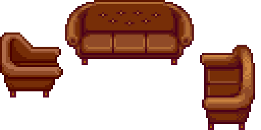

# How to define Collisions?

This field is [Directional](../Directional%20Fields.md).

It's 2 main properties give the size ***in game tiles*** of the bounding box: "Width" and "Height" (both required), they must be integers.

The other propery of the Collisions field is its "Map" (optional), with it, you to decide for each tile of the bounding box if it is traversable or not. For example, this is the perfect tool if you want to make an arch that you can walk under.  
To define a custom collision Map, you first have to write it as a square of characters of the size of the bounding box. Let's take the "Living Room" Furniture from the Example Pack, it's made of Furniture from the game to give a proper reference. Here's its main sprite:  
  
This gif shows that its bounding box is 8x3, and its collision Map is represented by:
```
..XXXX..
XX....XX
......XX
```
In a collision Map, the tiles where the player can walk are represented by `.` and the tiles where they can't are represented by `X`. For now (probably forever), the precision of the collision Map is limited to tiles.

To properly put the collision Map in the Collisions model, the newlines have to be replaced by forward slashes `/`, which would look like this:
```json
{
	"Width": 8,
	"Height": 3,
	"Map": "..XXXX../XX....XX/......XX"
}
```

If your Custom Collision Map is filled with void `.`, it will be ignored (because you won't be able to pick-up a furniture with no Collisions).

Note: if the topmost row or the rightmost column of your Map is fill with `.`, you can remove it and reduce the bounding box size accordingly.

Note 2: if your Furniture uses a custom collision Map, there's a good chance that you'll have to define [Layers](../Furniture.md#layers) to avoid layering issues, like the player walking on or under the Furniture.