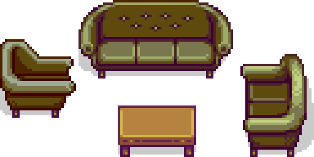

# How to define Layers?


The Layers field of a Furniture is a directional list of layer objects.

This is required for a Furniture to work: it needs at least 1 layer (refered to as the "base layer"). By default, the [Depth](#depth) of the base layer is `{"Tile": 0, "Sub": 0}` instead of `{"Tile": 0, "Sub": 1000}` to match what it was before version 3.0.0 (also it makes more sense).

Note: Only the first Layer is drawn when the Furniture is placed in a Slot because it is not possible to maintain how Depth is computed in a Slot.

A layer object has 3 fields:

## Source Rect (required) (directional)

The part of the source image this layer should draw on the screen, it's a [Rectangle](../Structures/Rectangle.md) **in pixels**.

## Draw Pos (directional)

This is the position, **in pixels**, relative to the bottom left of the furniture (for the current rotation), where the layer should be drawn. It is an **integer** [Vector](../Structures/Vector.md).

It defaults to `{"X": 0, "Y": 0}`, which means that the bottom left corner of the sprite is at the bottom left corner of the furniture, this matches the behavior of all vanilla Furniture. Keep in mind that the positive Y axis is down, so you have to use negative Y coordinate to move the layer up.

## Depth

This is the [depth](../Structures/Depth.md) at which the layer should be drawn. See the [Example](#example) to have examples of layers with depth.

Defaults to `{"Tile": 0, "Sub": 1000}` (it represents the bottom of the top-most tile of the Furniture's bounding box), except for the Base Layer, fot which it's `{"Tile": 0, "Sub": 0}`.

## Example

Here's an example on how to use layers with the down-facing `living_room` Furniture of the Example Pack. This is basically as complicated as it gets, I'd recommend checking some other Furniture from the Example Pack or other mods for simpler layers fitting your needs.

In this example, we will go through the layers from back to front. In this case, the lowest depth is the base layer (at `"Depth": {"Tile": 0, "Sub": 0}`).

This gif shows how the layers are drawn from back to front, with a Farmer to show how it would be drawn in-between the layers:



Here's the list of Layers for this Furniture facing down, from back to front:
```json
[
	{
		// Base layer, drawing everything at least once
		"Source Rect": { "X": 0, "Y": 0, "Width": 128, "Height": 64 }
		// Depth is {"Tile": 0, "Sub": 0} by default
	},
	{
		// Upper Arm of Armchair facing Right
		"Source Rect": { "X": 192, "Y": 32, "Width": 32, "Height": 32 },
		"Draw Pos": { "X": 0, "Y": -16 },
		"Depth": 1
	},
	{
		// Upper Arm of Couch facing Left
		"Source Rect": { "X": 192, "Y": 176, "Width": 32, "Height": 48 },
		"Draw Pos": { "X": 96, "Y": 0 },
		"Depth": 1
	},
	{
		// Lower Arm of Armchair facing Right
		"Source Rect": { "X": 192, "Y": 0, "Width": 32, "Height": 32 },
		"Draw Pos": { "X": 0, "Y": -16 },
		"Depth": { "Tile": 1, "Sub": 1000 }
	},
	{
		// Table (without the shadow)
		"Source Rect": { "X": 144, "Y": 224, "Width": 32, "Height": 32 },
		"Draw Pos": { "X": 48, "Y": 0 },
		"Depth": 2
	},
	{
		// Lower Arm of Couch facing Left
		"Source Rect": { "X": 192, "Y": 128, "Width": 32, "Height": 48 },
		"Draw Pos": { "X": 96, "Y": 0 },
		"Depth": { "Tile": 2, "Sub": 1000 }
	}
]
```

Keep in mind that the Source Rect is defined from [this spritesheet](../../Example%20Pack/[FF]/assets/seats/living_room.png). As you can see, all the shadows are on the Base Layer, this is a good rule to avoid weird shadows, but you can put transparent shadows if the Furniture is meant to cast a shadow on the Player (like an umbrella for example).