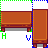

# What are Directional Fields?

Directional Fields is a type of field that *can* (not must) depend on the rotation of the Furniture, so that the value read by the mod will change depending on which direction the Furniture is placed in.

When a field is directional, its value can either be itself, or a dictionary with rotation names as keys and the actual data fields as values, the rotation names being defined in the Furniture's [Rotations](Furniture.md#rotations) field.  
In the following examples, we will assume that the Rotations are `["Down", "Right", "Up", "Left"]`.

If you have a doubt about the validity of a Directional Field you defined, you can rely on the json schema to tell you when there's a mistake. More info on how to set it up [here](Author.md#content).

## Directional Structure

There's only one place where a simple directional structure appears: the [Collisions](Furniture.md#collisions-required-directional). It can be defined as:
```json
"Collisions": {
	"Down": {
		// Collisions Down
	},
	"Right": {
		// Collisions Right
	},
	"Up": {
		// Collisions Up
	},
	"Left": {
		// Collisions Left
	}
}
```

But if the Collisions are the same in all directions (or if there is only a single direction), you can omit the direction keys like this:
```json
"Collisions": {
	// Single Collisions definition
}
```

## Directional List

The fields that are both directional and a list are:
- [Layers](Furniture.md#layers-required-directional)
- [Seats](Furniture.md#seats-directional)
- [Slots](Furniture.md#slots-directional)
- [Lights](Furniture.md#lights-directional)
- [Particles](Furniture.md#particles-directional)

Let's take the Furniture's [Layers](Complex%20Fields/Layers.md) as an example. If you choose to have a single Layer for every rotation, the field will look like this:
```json
"Layers": {
	"Source Rect": { "X": 0, "Y": 0, "Width": 32, "Height": 32 }
}
```

But if you want each rotation to look different (which you often do), you need to use the directional variant of this field.  
For this example, we'll take the "Table Test" Furniture of the Example Pack. It has `"Rotation": 2`, if you read about the Furniture `Rotations` field, you'll now that its rotation keys are "Horizontal" and "Vertical". This is how its `Layer` looks like:
```json
"Layers": {
	"Horizontal": {
		"Source Rect": { "X": 0, "Y": 0, "Width": 32, "Height": 32 }
	},
	"Vertical": {
		"Source Rect": { "X": 32, "Y": 0, "Width": 16, "Height": 48 }
	}
}
```
  
You can see how each object in the `Layers` definition matches a part of the sprite-sheet.

Directional lists can also be defined by an array instead of an object, this works the same way. Here what it looks like when it is non-directional:
```jsonc
"Layers": [
	{
		// First layer (not directional)
	},
	{
		// Second layer (not directional)
	},
	// As many other layers as you want
]
```

And what it looks like when directional:
```jsonc
"Layers": {
	"Down": [
		// My layers applied when the rotation is "Down"
	],
	"Right": [
		// My layers applied when the rotation is "Right"
	],
	"Up": [
		// My layers applied when the rotation is "Up"
	],
	"Left": [
		// My layers applied when the rotation is "Left"
	]
}
```

Some fields do not require a value for every direction. For example, if your Furniture only has Particles when it's facing Right or Left, but not when it's facing Up or Down, you can reduce the field to this:
```json
"Particles": {
	"Right": [
		// My particles applied when the rotation is "Right"
	],
	"Left": [
		// My particles applied when the rotation is "Left"
	]
}
```

## Directional Sub-Fields

Some directional lists have properties which are themselves directional (marked by `(directional)` in this documentation), this means that if the field is very similar in all directions but only one of its properties changes, you can define it once with a directional property.  
For example, here's a valid variant of the `Table Test`'s `Layers` (this is exactly equivalent to the structure given in the previous part, right above the image):
```json
"Layers": {
	"Source Rect": {
		"Horizontal": {
			"X": 0,
			"Y": 0,
			"Width": 32,
			"Height": 32
		},
		"Vertical": {
			"X": 32,
			"Y": 0,
			"Width": 16,
			"Height": 48
		}
	}
}
```
Here, there is a single Layer, but its Source Rect is directional, this is usefull if this layer has other fields that do not change depending on the direction, it avoids repeating them for each direction.

Of course, this also works when having a list of Layers (or any other directional list):
```json
"Layers": [
	{
		"Source Rect": {
			"Horizontal": {
				"X": 0,
				"Y": 0,
				"Width": 32,
				"Height": 32
			},
			"Vertical": {
				"X": 32,
				"Y": 0,
				"Width": 16,
				"Height": 48
			}
		},
		// Other fields in this layer
	},
	{
		// Another layer, can also use directional sub-fields
	}
]
```

You can ignore this feature if it's too complex for you. This is used a lot for the `Player Direction` of sittables in the Example Pack if you want to see more examples.