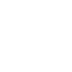

# Custom Furniture definition

To make Furniture highly customizable, the definition of a Furniture has a lot of properties. But don't worry, everything is explained here, and you won't need to use everything in most cases.

Once again, this documentation uses the [Example Pack](../Example%20Pack) as an example, it is strongly recommeded to go back and forth between the explanation here and the examples to identify what is being explained.

When it is question of coordinates (x and y, position or size), it will always be defined as x left to right and y top to bottom, this is the convention for anything related to computer graphics. This puts (0, 0) in the top left corner (so `{"X": 0, "Y": 0}` will be the top left pixel in images).  


## Contents

* [Priority](#priority)
* [Display Name](#display-name)
* [Rotations](#rotations-required)
* [Source Image](#source-image-required)
* [Layers](#layers-required-directional)
* [Collisions](#collisions-required)
* [Vanilla Fields](#vanilla-fields)
	* [Force Type](#force-type)
	* [Price](#price)
	* [Placement Restriction](#placement-restriction)
	* [Context Tags](#context-tags)
	* [Exclude from Random Sales](#exclude-from-random-sales)
* [Custom Catalogue Shop](#custom-catalogue-shop)
	* [Shows in Shops](#shows-in-shops)
	* [Shop Id](#shop-id)
* [Variants](#variants)
	* [Image Variants](#image-variants)
	* [Rect Variants](#rect-variants)
* [Description](#description)
* [Animation](#animation)
* [Special Type](#special-type)
* [Placement Type](#placement-type)
* [Icon Rect](#icon-rect)
* [Toggle](#toggle)
* [Time Based](#time-based)
* [Sounds](#sounds)
* [Seats](#seats-directional)
* [Slots](#seats-directional)
* [Light](#lights-directional)

## Priority

This is an integer to change the priority of this Furniture being loaded if other packs define a Furniture with the same ID. A lower number in this field makes this Furniture not load if another Furniture has the same ID with a higher Priority number, the default is 1000.  
This can be used if you have multiple Included Packs defining the same Furniture to leave a choice to the player through config option checkboxes.

## Display Name

This is the name of the Furniture as it will be displayed in game, it has basically no restriction, except that it must be a string (text between quotation marks `"`).  
This field is not actually required, but it doesn't really make sense to not have it: it will default to "No Name".

If using [Furniture Variants](#variants), you can use 2 "tokens" to use the variants keys in the Furniture Display Name:
- `[[ImageVariant]]`
- `[[RectVariant]]`

For example, the `"[[ImageVariant]] Armchair Test"` Furniture from the Example Pack will create 3 Furniture:
- Brown Armchair Test
- Yellow Armchair Test
- Blue Armchair Test

And the `"[[RectVariant]] Cat Statue"` Furniture will create 2 Furniture:
- White Cat Statue
- Black Cat Statue

## Rotations (required)

This field allow you to define rotations. It can be of 2 types: an integer (a whole number), or a list of rotation names.  
If it is set to a list of rotation names, the number of names given corresponds to the number of rotations. The names given will be used as "rotation keys" in [Directional Fields](Directional%20Fields.md) (you'll see about this soon).  
If it is set to an integer, it simply gives the number of rotations of the Furniture. For example, a table has 2 rotations (horizontal and vertical), and a chair has 4 rotations (up, right, down and left).  
When using a number of rotations instead of a list of names, the resulting "rotation keys" are hardcoded:
- `"Rotations": 1` -> `"Rotations": ["NoRot"]` (no need to use the key anywhere when there's only one rotation)
- `"Rotations": 2` -> `"Rotations": ["Horizontal", "Vertical"]`
- `"Rotations": 4` -> `"Rotations": ["Down", "Right", "Up", "Left"]`

Any other number will result in an error because rotation keys are essential to parse Directional Fields. If you don't need to use Directional Fields, then the Rotations should be set to 1 (the Furniture cannot be rotated).

Note: the order of the rotation names will only define in which order they cycle when using right-click when placing a Furniture in game.

Note 2: you can set as many rotations as you want! Just make sure that they have distinct names. Here's an example with 6 rotations: 
```json
"Rotations": ["r1", "r2", "r3", "r4", "r5", "r6"]
```
You'll just have to remember to use these names as keys when defining directional fields.

## Source Image (required)

This is the path, **relative to your mod's directory**, to the sprite-sheet to use for this Furniture. All sprites used in drawing your Furniture in the game (all rotations and layers) have to be in the same sprite-sheet. It is also possible to use the same sprite-sheet for multiple Furniture.  
<span style="color:red">It is **strongly** recommended to align all sprites on a 16x16 pixel grid</span>, because every game tile is 16x16 pixels large, not doing so will cause a lot of issues down the line.

Note: in this field and any other image path, you can access files from the games assets by starting the path with "Content/", or assets from the Furniture Framework by starting with "FF/".

Note 2: if you want to edit/load this image with a Content Patcher mod, the patch would have `FF/<Furniture Pack UniqueID>/<Source Image path>` as a target, with `<Source Image path>` the path you wrote in this field, including any eventual "Content/" or "FF/" from last Note.

## Layers (required) (directional)

Layers are an important tool for making custom Furniture, they are necessary to properly display your Furniture when other objects are passing through it (the player, or other Furniture). Since they are quite complicated, they have their own [Layers documentation](Complex%20Fields/Layers.md).  
This is also the first and most important [Directional Field](Directional%20Fields.md), so you might want to read that as well.

## Collisions (required) (directional)

This field defines the collisions of your Furniture, it's what defines what part of the Furniture the player will not be able to walk through and place other Furniture on. Since they are quite complicated, they have their own [Collisions documentation](Complex%20Fields/Collisions.md).

## Vanilla Fields

These fields are basically what you'll find in a Furniture defined in [`Data/Furniture`](https://stardewvalleywiki.com/Modding:Items#Furniture).

### Force Type

In this field, you can force the vanilla type of the Furniture (as a string). If you don't know how it works, don't set it: most types have not been tested and are replaced with other fields in the Furniture Framework. Please report it if you find Furniture types that completely break the mod so that I can list them here.

The types listed here have been tested and will cause some issues, you should use FF's features to replace them:
- chair
- bench
- couch
- armchair
- long table
- table
- dresser
- rug
- painting

### Price

This is the default price of the Furniture, it will be used if it is added to a shop's item list without specifying a price. It defaults to 0g.  
To have more freedom on what the price will be in different shops, you'll have to patch each shop manually with Content Patcher. The currency also depends on the shop data, not the item data.

### Placement Restriction

This field is a number that defines if the Furniture can be placed indoor and/or outdoor. Here are the possible values:
- `0`: indoors only
- `1`: outdoors only
- `2`: indoors and outdoors (default)

### Context Tags

This is an array (a list) of context tags you want to add to your Furniture, it defaults to an empty list. If you want to learn more about context tags, check [the wiki](https://stardewvalleywiki.com/Modding:Items#Context_tags).

### Exclude from Random Sales

This defines wether or not this Furniture will show-up in random sales in the vanilla Furniture Catalogue and other Furniture shops. It's a boolean value (true or false), defaulting to true.

## Custom Catalogue Shop

Those fields are related to Shops and Catalogues.

### Shows in Shops

This is an array (a list) of string Shop IDs where you want your Furniture to show-up, it defaults to an empty list.  For example, having:
```json
"Shows in Shops": ["Carpenter"]
```
will add your Furniture to Robin's Shop. Here's the list of [vanilla Shop IDs](https://stardewvalleywiki.com/Modding:Shops#Vanilla_shop_IDs) on the wiki. It's also possible to add your Furniture to shops and catalogues from other mods, you just need to make sure to get the exact Shop ID from it.

When used in combination to the "Shop Id" field, you can create a custom Catalogue for your custom Furniture.

The token `[[ModID]]` can be used in this field.

### Shop Id

The Shop ID of the Shop the game should open when right-clicking on the Furniture, it's a string that defaults to `null` (no Shop attached).  
You can attach one of the [vanilla Shops](https://stardewvalleywiki.com/Modding:Shops#Vanilla_shop_IDs), or your own Shop. Be carefull, some shops have some weird quirks when their owner is not around.  
By default, if the Shop ID given doesn't match any existing shop, a default shop similar to the vanilla Furniture Catalogue (no owner) will be created.  
You can then use the same Shop ID in the "Shows in Shops" field of other Furniture you created to add them to this new Catalogue.  
All Furniture in the Example Pack are put in a custom catalogue also defined in it.

If you want to add more rules to your custom Catalogue (multipliers, prices, owners, ...), you'll need to define it in another mod using Content Patcher, see how to make a [Mixed Content Pack](Author.md#content-patcher-integration).

Note: the Shop ID is raw, your mod's UniqueID will not be prepended to it, so make sure it's unique (you can manually add your mod's ID to it by using `[[ModID]]` for example).

## Variants

This is kind of a replacement for a compatibility with Alternative Textures because making this mod truly compatible with AT might never be possible.  
You might want to create a batch of Furniture with the same properties but different sprites, there are 2 options for this:

### Image Variants

Image Variants will allow you to have each variant based on a different Source Image.

To define them, instead of giving a single path in the [Source Image](#source-image), you can give a dictionary of paths:
```json
"Source Image": {
	"Brown": "assets/armchair.png",
	"Yellow": "assets/armchair_yellow.png",
	"Blue": "assets/armchair_blue.png"
},
```
This example is taken from the `armchair_test` Furniture of the Example Pack.

Note: this will create as many separate Furniture as source images are given, but all their properties (aside from Source Image) will be identical, including their Display Name. However, you can use the `[[ImageVariant]]` token in the Display Name field so that it will be replaced with the variant key (see the `armchair_test` Furniture in the Example Pack).  

Note 2: you can also use a list of Source Image Variants instead of a dictionary but the `[[ImageVariant]]` token will be a number.

### Rect Variants

Rect Variants will allow you to have each variant based on a different part of the Source Image.

To define them, you have to give `"Source Rect Offsets"`:
```json
"Source Rect Offsets": {
	"White": {"X": 0, "Y": 0},
	"Black": {"X": 0, "Y": 32}
},
```
This example is taken from the `cat_statue` Furniture of the Example Pack.

These Offsets are **integer** [Vectors](Structures/Vector.md) that defines by how many pixels the source rectangles should be offset to find the sprites for the given Variant.

Note: this will create as many separate Furniture as offsets are given, but all their properties will be identical, including their Display Name. However, you can use the `[[RectVariant]]` token in the Display Name field so that it will be replaced with the variant key (see the `cat_statue` Furniture in the Example Pack).  

Note 2: you can also use a list of Source Rect Offsets instead of a dictionary but the `[[RectVariant]]` token will be a number.

## Description

The description of the Furniture that will be displayed in the game. If this is not set, the game will use one of the default descriptions that depends on the [placement restriction](#placement-restriction) of the Furniture (like vanilla Furniture have). Variant tokens can be used in this field.

## Animation

The `Animation` field requires some properties to be set in order to work properly:
- `Frame Count`: the number of animation frames
- `Frame Duration`: the length of every frame in milliseconds
- `Animation Offset`: the position of each frame relative to the preceding frame.

The `Animation Offset` is an **Integer** [Vector](Structures/Vector.md) field. At every new animation frame, the top left of every Layer's Source Rect will be moved by this offset, so you can have your animations aligned however you want in your sprite-sheet.  
You can also use a list of offsets, which must have as many values as there are Frames, to define the specific Source Rect offset of each frame individually.

Note: if any of these field is zero ((0, 0) for the Offset), the animation will be disabled.  

Here's an example of the fields for a working animation taken from the `cat_statue` in the Example Pack:
```json
"Animation": {
	"Frame Count": 7,
	"Frame Duration": 500,
	"Animation Offset": {"X": 16, "Y": 0}
}
```

Note 2: If using both [Source Rect Offsets](#rect-variants) and Animation, the offsets will be added together.

## Special Type

This kind of replace the "Type" field in the vanilla Furniture data. It's a string that can take one of these values:
- None (no special type, default)
- Dresser
- [TV](Special%20Types/TV.md)
- [Bed](Special%20Types/Bed.md)
- [FishTank](Special%20Types/FishTank.md)

Some Special Types have their own documentation linked in this list for extra info.

## Placement Type

This will change the way you place the Furniture, it's only used for Rugs and Wall mounted Furniture. The possible values are:
- Normal (default)
- Rug
- Mural

Please note that some right-click interactions might not work for Rug Furniture (not tested, you can make experiments). However, Mural Furniture should be compatible with all other features.

## Icon Rect

This field is a Rectangle, like a Layer's [Source Rect](Complex%20Fields/Layers.md#source-rect-required-directional). This rectangle will tell the game which part of the texture to use to display the Furniture in the menu. It is affected by [Variants](#variants). If this is not set, the first Layer will be shown in the menu instead.

## Toggle

This field is boolean (true or false) and will make a Furniture toggleable. "Toggleable" means that it can be turned on and off with right-click.  
When a Furniture can be toggled, every sprite in its sprite-sheet needs to be duplicated: for every "Source Rect" you defined (in the [Layers](#layers)), the Width of the Rectangle will be added to its horizontal position when the Furniture is turned on. This way, your Furniture can change how it looks when it's toggled.

A good example of this is the `Lamp Test` Furniture in the Example Pack: you can see in its sprite-sheet that it has its base sprite on the left, while the "On" variant of its sprite is on the right of the sprite-sheet.  


## Time Based

This field is boolean (true or false) and will make your Furniture change when it's dark outside (whether with night or rainy weather), like windows and lamps will in the Vanilla game.  
When a Furniture is Time Based, every sprite in its sprite-sheet needs to be duplicated: for every "Source Rect" you defined (in the [Layers](#layers)), the Height of the Rectangle will be added to its horizontal position when it's dark outside, this way, your Furniture can change how it looks.

A good example of this is the `Window Test` Furniture in the Example Pack: you can see in its sprite-sheet that it has its base sprite on the top, while the "Night" variant of its sprite is on the bottom of the sprite-sheet.  


## Sounds

With sounds, you can make your Furniture play custom sound effects when you click on it! Since they are quite complicated, they have their own [Sounds documentation](Complex%20Fields/Sounds.md).

## Seats (directional)

Seats are what allow the Farmer to sit on your Furniture (duh), since they are quite complicated, they have their own [Seats documentation](Complex%20Fields/Seats.md).

## Slots (directional)

Slots are where you can place items or other Furniture on a table-like Furniture. Since they are quite complicated, they have their own [Slots documentation](Complex%20Fields/Slots.md).

## Particles (directional)

Particles have so many settings, you have to read the [Custom Particles Documentation](Complex%20Fields/Particles.md).

## Lights (directional)

You can place Light Sources on your Furniture with this field, see the [Custom Light Sources Doc](Complex%20Fields/Lights.md).
